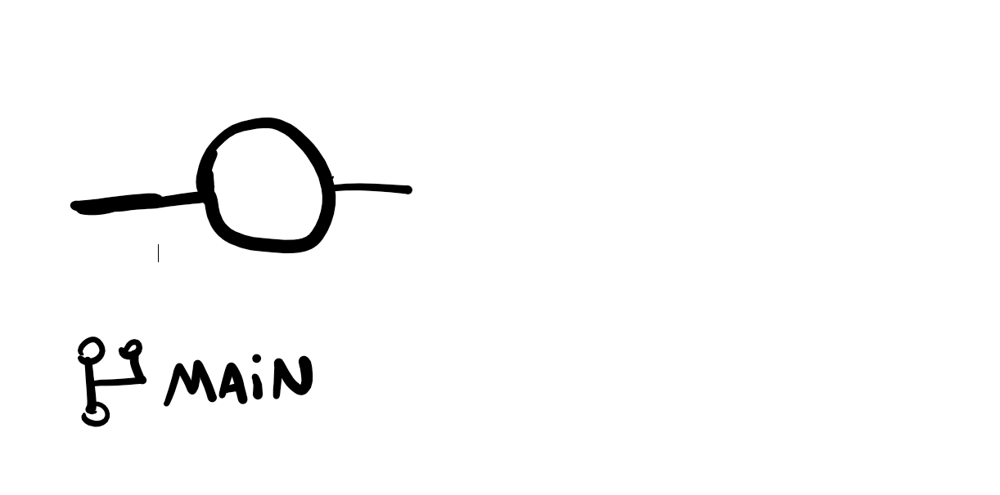
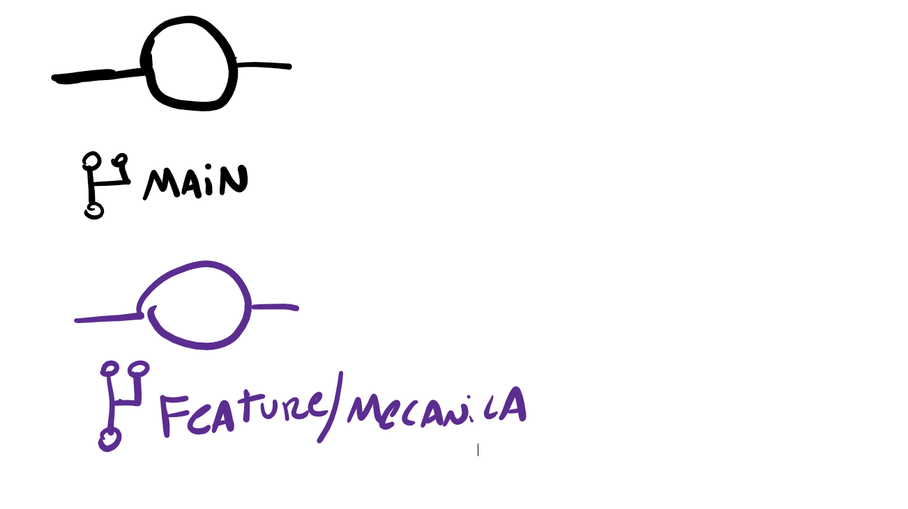
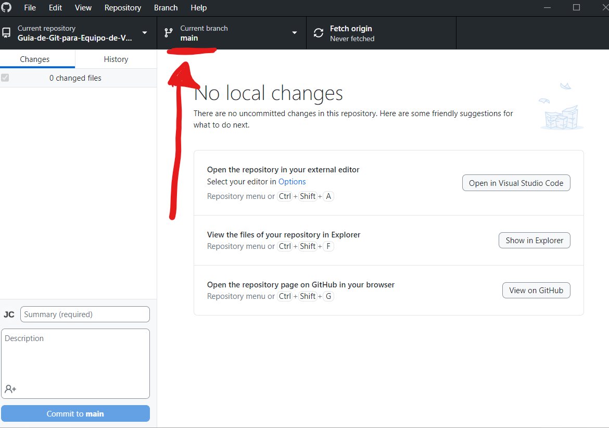
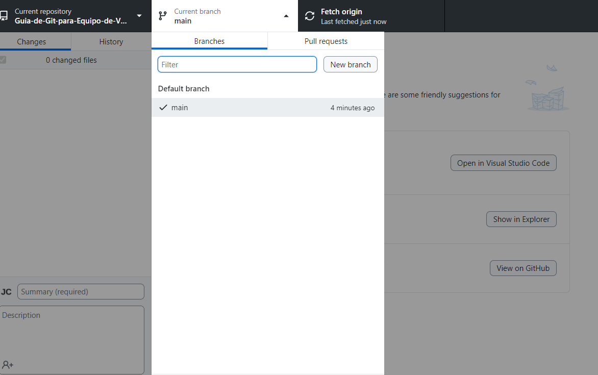
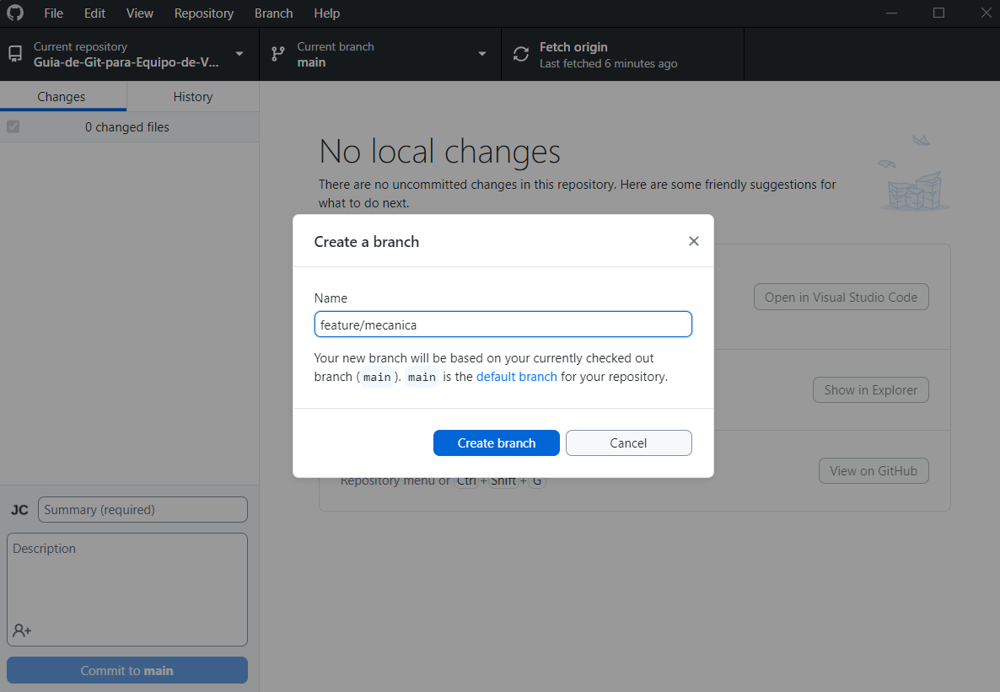
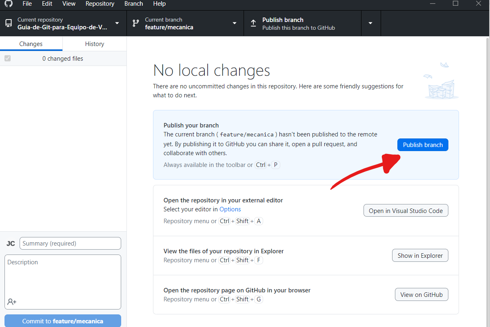

# Guia GIT para equipos de Videojuegos

El objetivo de esta Guia es dar una introducción corta a la teoría de GIT para comenzar a utilizarlo en equipos de Videojuegos sin necesidad de tener experiencia previa.

## ¿Qué es GIT?
Git es un sistema de control de versiones que permite a un equipo de trabajo gestionar cambios en un proyecto de manera eficiente. Se utiliza en simples palabras para trabajar de forma paralela para luego unir los cambios y avanzar el proyecto.

## ¿Cómo usar GIT?

GIT utiliza un sistema de ramas para controlar las versiones del proyecto.

### Sistema de Ramas (Branches)
 
Cada proyecto comienza con una rama inicial usualmente llamada: **main o master**

Esta rama por convención trae la versión definitiva del proyecto, es decir, la versión que sera la llevada a producción.

> **OJO:** MUCHO CUIDADO CON SUBIR CUALQUIER CAMBIO A ESA RAMA!!

Dado que no queremos que cualquier cambio pase a **main** lo que usualmente se hace es trabajar en una rama aparte. 

En general, se le pone un nombre con el cambio a subir e.g:

- feature/mecanica 
- fix/arreglo-de-bugs
- music/tema-principal
- feature/modelo3d-casa

Perfecto, ahora ya entiendes que no tienes que trabajar en main (en serio,no trabajes en main) ¿Qué viene a continuación?

### Moverte de Rama y Crear otra Rama

Normalmente al clonar un repositorio de Github se te dira en que rama estas parado:

Presionamos ahi para crear una rama

Le ponemos un nombre y la creamos

Publicamos la rama para que todos la puedan ver

