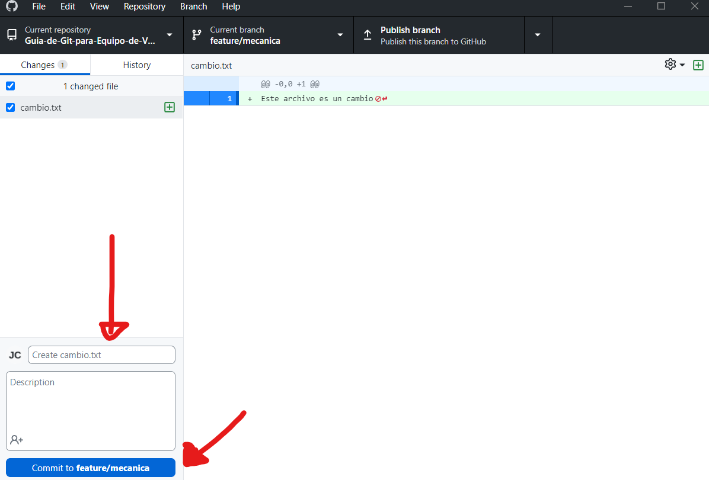

# Guia GIT para equipos de Videojuegos

El objetivo de esta Guia es dar una introducción corta a la teoría de GIT para comenzar a utilizarlo en equipos de Videojuegos sin necesidad de tener experiencia previa.

## ¿Qué es GIT?
Git es un sistema de control de versiones que permite a un equipo de trabajo gestionar cambios en un proyecto de manera eficiente. Se utiliza en simples palabras para trabajar de forma paralela para luego unir los cambios y avanzar el proyecto.

## ¿Cómo usar GIT?

GIT utiliza un sistema de ramas para controlar las versiones del proyecto.

### Sistema de Ramas (Branches)
 
Cada proyecto comienza con una rama inicial usualmente llamada: **main o master**

Esta rama por convención trae la versión definitiva del proyecto, es decir, la versión que sera la llevada a producción.

> **OJO:** MUCHO CUIDADO CON SUBIR CUALQUIER CAMBIO A ESA RAMA!!

Dado que no queremos que cualquier cambio pase a **main** lo que usualmente se hace es trabajar en una rama aparte. 

En general, se le pone un nombre con el cambio a subir e.g:

- feature/mecanica 
- fix/arreglo-de-bugs
- music/tema-principal
- feature/modelo3d-casa

Perfecto, ahora ya entiendes que no tienes que trabajar en main (en serio, no trabajes en main) ¿Qué viene a continuación?

### Moverte de Rama y Crear otra Rama

Normalmente al clonar un repositorio de Github se te dira en que rama estas parado:

Presionamos ahi para crear una rama

Le ponemos un nombre y la creamos

Publicamos la rama para que todos la puedan ver

Verificamos que hemos cambiado de Rama

Enhorabuena, has cambiado de rama y ya no tienes que preocuparte que tus cambios hagan explotar el proyecto. Dado que si no estas en main, no afecta a la version productiva!!!!!!! Wojoooo!!

## ¿Cómo subir Cambios?

Muy bien, ya nos hemos cambiado a una rama donde podemos subir cosas sin tener miedo a que rompan el proyecto. Ahora aprenderemos como subir cambios

### Sistemas de commits

Los commits en GIT representan una serie de cambios en un momento fijo de tiempo, es decir, es como si le tomaran una foto al proyecto en un instante preciso y lo guardaran en un paquete para subirlo.

 Los commits usualmente son representados como circulitos en una rama. En la siguiente imagen la rama **main** y la rama **feature/mecanica** tienen un commit: 

Supongamos que creamos un commit en la rama **feature/mecanica** para avanzar en la mecanica principal del juego, luego la imagen se veria de la siguiente forma:

### ¿Cómo realizamos un commits?
Supongamos que hago un cambio en **feature/mecanica**. En este caso, creo un archivo llamado cambio.txt

> **OJO:** Los cambios no son solo código, puede ser subir modelado 3D, arte o música. En general cualquier archivo agregado, borrado o modificado cuenta como cambio

Al abrir nuestro Github for Windows, nos aparecera los cambios reflejados. En este caso en la esquina izquierda nos permite crear un commit con los cambios que hemos hecho hasta ese momento

Al commit le agregamos una titulo y una descripción clara para que todo el equipo pueda entender lo que hicimos

Finalmente creamos el commit, al crear el commit tan solo nuestro repositorio local tendra este cambio (Solo hemos hecho este cambio en nuestra computadora). Para pasar este commit local al repositorio de Github tendremos que hacer *push*

En este caso Github for Windows nos entrega la opción de *push origin* la cual sube nuestro commit local al repositorio que se encuentra en Github para que todo nuestro equipo pueda verlo

